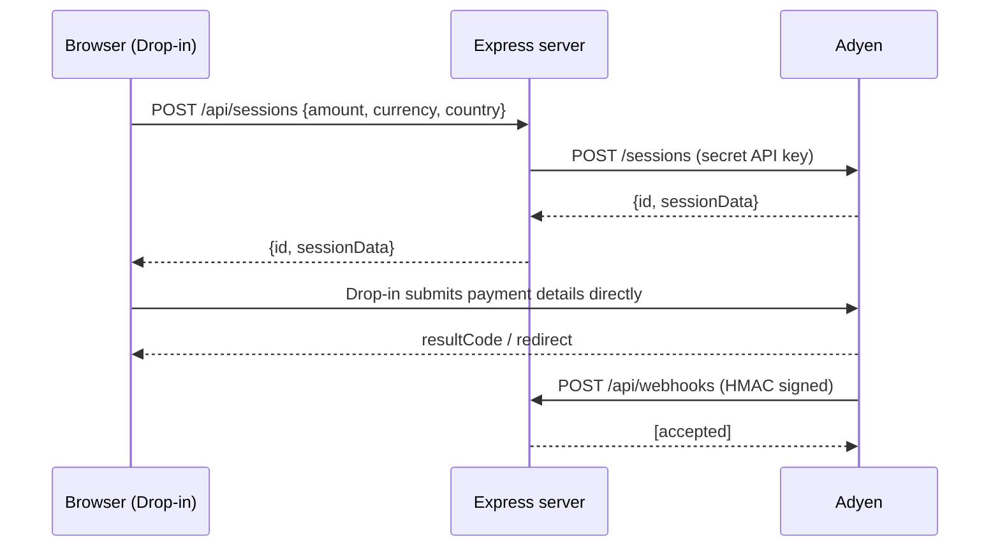

# adyen-payments-test

A minimal, self-contained harness for testing an Adyen Checkout integration:
Express + TypeScript backend, Adyen **Sessions** flow, and the Adyen **Web Drop-in**
in the browser. Includes an HMAC-verified webhook receiver and the Adyen MCP
server wired into VS Code.

## Architecture



The secret API key never leaves the server. The browser only receives the public
client key from `GET /api/config`.

## Prerequisites

- Node.js >= 20
- An Adyen **test** account: <https://www.adyen.com/signup>
- A webservice user with an API key, a client key, and a merchant account

In the Adyen test Customer Area:

1. **Developers > API credentials** — create/choose a webservice user, generate an
   API key and a client key.
2. Add `http://localhost:8080` to the client key's **allowed origins**.
3. **Developers > Webhooks** — add a Standard webhook, enable HMAC and copy the key.

## Setup

```bash
cp .env.example .env   # then fill in the values
npm install
npm run dev            # http://localhost:8080
```

Open <http://localhost:8080>, create a session and pay with a test card, e.g.
Visa `4111 1111 1111 1111`, expiry `03/30`, CVC `737`.
Full list: <https://docs.adyen.com/development-resources/testing/test-card-numbers/>

## Scripts

| Command                       | Purpose                                       |
| ----------------------------- | --------------------------------------------- |
| `npm run dev`                 | Start with hot reload                         |
| `npm run build` / `npm start` | Compile to `dist/` and run                    |
| `npm test`                    | Unit + integration tests (Vitest + Supertest) |
| `npm run typecheck`           | Type-check without emitting                   |

## Deploy to Vercel

Vercel runs the Express backend as a Node.js function and serves `public/`
through its CDN. `vercel.json` preserves the static-page security headers and
routes `/result` to the payment return page.

1. Push this repository to your Git provider and import it into Vercel. Select
   the **Express** framework preset with the repository root as the root
   directory. Leave build and output settings at their framework defaults.
2. In **Project Settings > Environment Variables**, configure these values for
   the Vercel deployment environment you will use:

| Variable                                            | Value                                                   |
| --------------------------------------------------- | ------------------------------------------------------- |
| `ADYEN_API_KEY`                                     | Secret API key from the Adyen Test Customer Area        |
| `ADYEN_CLIENT_KEY`                                  | Public client key from the same API credential          |
| `ADYEN_MERCHANT_ACCOUNT`                            | Your test merchant account                              |
| `ADYEN_ENVIRONMENT`                                 | `TEST`                                                  |
| `PUBLIC_BASE_URL`                                   | `https://your-project.vercel.app` or your custom domain |
| `ADYEN_HMAC_KEY`                                    | HMAC key for the webhook, if configured                 |
| `ADYEN_WEBHOOK_USERNAME` / `ADYEN_WEBHOOK_PASSWORD` | Optional webhook authentication                         |

Keep secrets server-side; do not commit `.env` or add public prefixes to
secret variables. No `PORT` setting is needed on Vercel. A Vercel Production
deployment can still use Adyen `TEST` credentials and does not enable real
payments. 3. In **Adyen Test Customer Area > Developers > API credentials**, select the
credential associated with your client key. Add the exact HTTPS origin,
such as `https://your-project.vercel.app`, under **Allowed origins** and save.
Include no path or trailing slash. Keep the localhost origin for local use. 4. Deploy or redeploy after changing environment variables. Open `/healthz`,
then create a checkout and verify that Drop-in loads before testing payment. 5. For webhooks, register `https://your-project.vercel.app/api/webhooks` in Adyen
with the matching HMAC key and optional basic-auth credentials. Ensure Vercel
Deployment Protection does not block Adyen's requests.

For Preview deployments, set `PUBLIC_BASE_URL` to the preview URL and add that
exact origin in Adyen as well. Prefer a stable domain for payment testing rather
than allowing every `*.vercel.app` site. If the origin is not allowed, the browser
can report `TypeError: Failed to fetch` when Adyen's session setup fails CORS.

To roll back, promote a previous working deployment from Vercel's deployment
history. Check that its domain, environment variables and Adyen allowed origin
still match.

## API

| Method | Path                                      | Description                      |
| ------ | ----------------------------------------- | -------------------------------- |
| `GET`  | `/healthz`                                | Liveness probe                   |
| `GET`  | `/api/config`                             | Public client key + environment  |
| `POST` | `/api/sessions`                           | Create an Adyen Checkout session |
| `GET`  | `/api/sessions/:id/result?sessionResult=` | Resolve a session outcome        |
| `POST` | `/api/webhooks`                           | Adyen standard webhook receiver  |

`POST /api/sessions` body:

```json
{ "amountValue": 1000, "currency": "EUR", "countryCode": "NL" }
```

`amountValue` is in **minor units** (1000 = EUR 10.00). The merchant account and
the shopper return URL are derived server-side and cannot be set by the client.

## Order confirmation and demo refunds

The checkout button reads **Order**. An authorised payment opens `/result` with
an **Order placed** receipt, the selected meal and toppings, and help actions.
Pending payments stay labelled **Payment pending**, not confirmed orders.

- **Request refund** asks for confirmation and calls
  `POST /api/sessions/:id/refund` with the opaque `sessionResult` proof. The server
  verifies that result with Adyen, requires one completed authorised payment,
  and obtains the PSP reference from Adyen, never from the browser.
- The TEST-only endpoint uses Adyen's
  [reversal API](https://docs.adyen.com/online-payments/reversal/), which refunds
  a captured payment or cancels an uncaptured payment. A stable idempotency key
  prevents duplicate reversal requests. LIVE requests are rejected.
- A `received` response means the request was accepted, **not** that money was
  returned. Subscribe to `CANCEL_OR_REFUND`, `REFUND_FAILED` and
  `REFUNDED_REVERSED` webhooks to monitor the outcome. The existing webhook
  receiver logs them; this demo does not persist or poll the final status.
- **Issue with order** saves the reason and details in this browser's
  `sessionStorage`. It does not send a support ticket. Receipts and issues are
  per-tab demo data, not an order management database.

The API credential must be permitted to modify the payment. Test refunds use
test funds only. Production self-service refunds require authenticated ownership,
durable order and refund state, webhook reconciliation and refund policies.
For captured-payment-only or partial refunds, see Adyen's
[refund guide](https://docs.adyen.com/online-payments/refund/).

## Receiving webhooks locally

Adyen must reach your machine, so expose the port with a tunnel and register the
public URL (plus `/api/webhooks`) as the webhook endpoint:

```bash
npx localtunnel --port 8080
```

Set `PUBLIC_BASE_URL` to the tunnel URL so redirect-based payment methods return
to the right place.

## Adyen MCP server

[`.vscode/mcp.json`](.vscode/mcp.json) registers the official
[Adyen MCP server](https://github.com/Adyen/adyen-mcp) so Copilot can create
payment links, inspect webhooks, list terminals, and so on.

- VS Code prompts for the API key on first use and stores it in secret storage —
  it is never written to a file in this repo.
- Start it from the Command Palette: **MCP: List Servers > adyen-mcp-server > Start**.
- The server runs against `--env=TEST`. For LIVE, add
  `--livePrefix=YOUR_PREFIX` to `args`.

The webservice user needs the roles listed in the Adyen MCP README (Checkout
Webservice, Merchant PAL Webservice, Management API read roles, ...). Create a
dedicated user with the narrowest set of roles you need.

Example prompts once the server is running:

- "List my Adyen merchant accounts."
- "Create a EUR 25.00 payment link for merchant account X."
- "Show the status of payment link PL...".

## Security notes

- API key, HMAC key and webhook credentials come from environment variables only;
  `.env` is git-ignored.
- All webhook notifications are HMAC-verified and optionally basic-auth protected,
  with timing-safe credential comparison.
- Request bodies are validated and size-capped; provider errors are logged
  server-side and returned to the client as a generic `502`.
- `helmet` sets a CSP that only allows the Adyen Checkout origins.
- This harness is for **TEST**. Before going live, add persistence, idempotent
  webhook processing, and PCI-DSS-appropriate logging controls.
